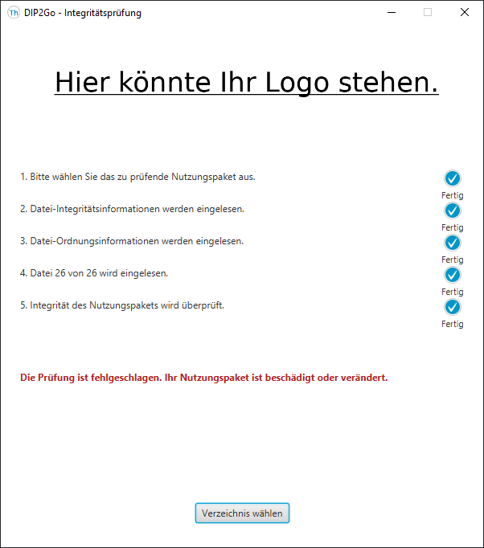
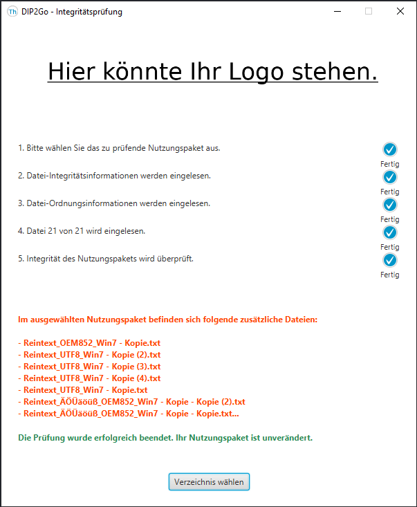
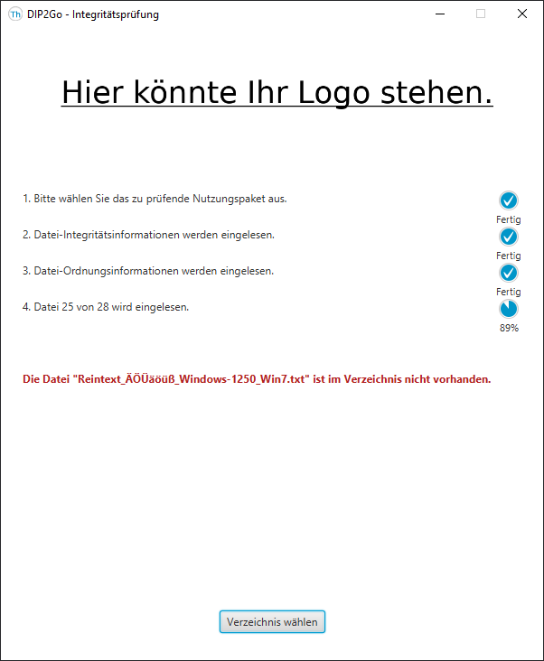

## DIP2Go - Integritätsprüfung

Dieses Projekt stellt Ihnen eine Java-Biliothek zur Integration in eigene Projekte, eine Kommandozeilen-Anwendung zum Erstellen und Testen der Integritätsinformation von Nutzungspaketen und eine grafische Benutzeroberfläche zum Testen der Integrität zur Verfügung.

### Anmerkung

Die Codebeispiele in dieser Readme-Datei sind für Windows geschrieben, da wir davon ausgehen, dass die meisten Nutzer dieses Betriebssystem verwenden. Sollten Sie bspw. Linux nutzen, verwenden Sie einfach __/__ statt __\\__ .

### Nachnutzung

Alle bereitgestellten Komponenten können kostenfrei nachgenutzt werden, die genauen Bedingungen können Sie in der [Lizenzvereinbarung](./LICENSE) nachlesen. Die aktuellen JAR-Dateien für alle Komponenten finden Sie immer im [Binary Ordner](./bin). Diese können Sie auch direkt verwenden.

#### Voraussetzungen

Für die Verwendung der Komponenten benötigen Sie ausschließlich die Java Runtime Environment. Wir empfehlen Ihnen die aktuelle Version zu nutzen, wenn dies nicht möglich ist, sollte keine ältere Version als Java JRE 11 gewählt werden. Die Komponenten sollten auf allen gängigen Betriebssystemen funktionieren, getestet wurde die Funktionalität bereits auf Ubuntu 20.10 und Windows 10.

#### Kompilieren

Sollten doch einmal Quellcode Anpassungen nötig sein, ist auch das ohne größere Probleme möglich. In diesem Fall benötigen Sie ein Java JDK. Das JDK sollte nicht älter als Version 11 sein. Dieses Projekt verwendet das Build-Tool Gradle. Die Dokumentation für das Tool können Sie unter [https://docs.gradle.org/current/userguide/userguide.html](https://docs.gradle.org/current/userguide/userguide.html) abrufen. Gradle müssen Sie nicht extra installieren. Sie brauchen allerdings eine funktionierende Internetverbindung, damit Gradle die benötigten Bibliotheken laden kann.

 Wie Sie Gradle hinter einem Proxy verwenden, können Sie unter [https://docs.gradle.org/current/userguide/build_environment.html](https://docs.gradle.org/current/userguide/build_environment.html) nachlesen.

 Wenn Sie die Voraussetzungen erfüllt haben müssen Sie zum Erstellen der JAR-Dateien nur noch folgenden Befehl im Wurzelverzeichnis des Projekts ausführen:

 ```
.\gradlew build
 ```

Sie können das Projekt auch in Ihre bevorzugte IDE importieren, die meisten müssten mittlerweile die Gradle-Projekt-Dateien erkennen und automatisch integrieren.

### Bibliothek

Die Java Bibliothek kapselt alle Funktionen die zum Erstellen und Prüfen der Integritätsdateien benötigt werden. Bei den Integritätsdateien handelt es sich zum einen um eine Datei, welche die Datei Reihenfolge für das Nutzungspaket dokumentiert, diese essenziell für die Prüfung. Die zweite Datei speichert alle weiteren Informationen, die für die Prüfung benötigt werden. Sie können die Bibliothek wie jede andere Java Bibliothek in ein beliebiges Build-Tool einbinden und die bereitgestellten Klassen verwenden. So könnte bspw. die Komponente, die Ihre Nutzungspakete erzeugt so erweitert werden, dass die Integritätsdateien vor dem Export direkt in das Nutzungspaket integriert werden. Wie Sie die Bibliothek in Kommandozeilen-Anwendungen oder grafische Benutzeroberfläche verwenden, können Sie den anderen Komponenten entnehmen.

### Kommandozeilen-Anwendung

Die Kommandozeilen-Anwendung ist

### Grafische Benutzeroberfläche

bla bla bla

#### Erfolgreiche Integritätsprüfung


Bei einer erfolgreichen Integritätsprüfung wird eine entsprechende Erfolgsmeldung ausgegeben.

#### Primärdateien wurden verändert



Bei einer negativen Integritätsprüfung wird eine entsprechende Fehlermeldung ausgegeben.

#### Warnung vor Zusätzlichen Primärdateien im Nutzungspaket



Wenn Dateien im Verzeichnis des Nutzungspakets enthalten sind, die nicht bei der Erstellung der Integritätsinformation vorhanden waren, wird eine entsprechende Warnung ausgegeben, welche die zusätzlichen Dateien auflistet. Die Dateiliste wird abgekürzt, wenn diese auf Grund von fehlendem Platz nicht dargestellt werden kann.

#### Fehler bei fehlenden Dateien



Wenn im Nutzungspaket Primärdateien fehlen, kann die Integrität nicht weiter geprüft werden und es wird eine entsprechende Fehlermeldung ausgegeben.
