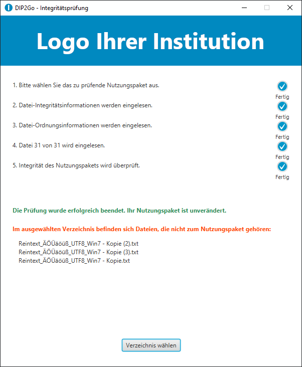

## DIP2Go - Integritätsprüfung

Die Integritätserhaltung ist eines der zentralen Problemstellungen der digitalen Langzeitarchivierung. Solange Inhalte von einem digitalen Archiv verwaltet werden, gibt es verschiedene Möglichkeiten die Integrität des Archivguts zu prüfen und zu garantieren, sobald sich die Dateien jedoch nicht mehr im Archiv befinden, ist dies deutlich schwieriger. Es gehört jedoch zu den Aufgaben der Archive der Öffentlichkeit den Zugang zu Teilen des Archivguts zu ermöglichen. Zu diesem Zweck werden Nutzungspakete (DIP) mit den benötigten Inhalten für die Archivnutzer exportiert. Das Problem sicherzustellen, ob die erhaltenen Dateien den ursprünglich archivierten Originalversionen entsprechen und ob das Nutzungspaket überhaupt vollständig ist, liegt nach dem Export beim Nutzer selbst. Im besten Fall enthält das Nutzungspaket eine Beschreibungsdatei in der die enthaltenen Dateien mit entsprechenden Prüfsummen (Hashwerten) aufgelistet werden. Die Prüfung der Integrität erfordert in diesem Fall technisches Vorwissen und ist mühselig und fehleranfällig.

Das Ziel dieses Projekts ist es eine einfache Möglichkeit zur Verfügung zustellen, mit denen Nutzungspakete noch Jahre nach dem Export auf ihre Integrität und Vollständigkeit überprüft werden können. Zu diesem Zweck hat das Landesarchiv Thüringen in Kooperation mit der [Professur für Mediensicherheit der Bauhaus-Universität Weimar](https://www.uni-weimar.de/de/medien/professuren/medieninformatik/mediensicherheit/home/) mehrere Java-Komponenten entwickelt.

Dieses Projekt stellt Ihnen eine Java-Bibliothek zur Integration in eigene Projekte, eine Kommandozeilen-Anwendung zum Erstellen und Testen der Integritätsinformation von Nutzungspaketen und eine grafische Benutzeroberfläche zum Testen der Integrität zur Verfügung.

Für die Integritätsprüfung werden Hashbäume verwendet, das Konzept hierfür wurde im [Vortrag](https://www.sg.ch/content/dam/sgch/kultur/staatsarchiv/auds-2014/exkurs/Praesentation%20Lucks.pdf) von Prof. Stefan Lucks auf der [AUdS 2014](https://www.sg.ch/kultur/staatsarchiv/Spezialthemen-/auds/2014.html) vorgestellt.

### Integritätsnachweis

Für den Nachweis, dass ein Nutzungspaket nicht durch Dritte verändert wurde, ist diese Anwendung nicht geeignet, da die Integritätsinformationen mit dem Nutzungspaket geliefert werden. Die Integritätsdateien sind nicht ausreichend gegen absichtliche Änderungen geschützt. Zur Nutzung der Anwendung für einen Integritätsnachweis ist es erforderlich, die Integritätsdateien der Nutzungspakete beim Erzeuger bzw. einem vertrauenswürdigen Dritten gesondert und sicher zu speichern und die dortigen Daten für die Überprüfung zu verwenden.

### Nachnutzung

Alle bereitgestellten Komponenten können kostenfrei nachgenutzt werden, die genauen Bedingungen können Sie in der [Lizenzvereinbarung](./LICENSE) nachlesen. Die aktuellen JAR-Dateien für alle Komponenten finden Sie immer im [JAR-Ordner](./jar). Diese können Sie auch direkt verwenden.

#### Voraussetzungen

Für die Verwendung der Komponenten benötigen Sie ausschließlich die Java Runtime Environment. Wir empfehlen Ihnen die aktuelle Version zu nutzen, wenn dies nicht möglich ist, sollte keine ältere Version als Java JRE 11 gewählt werden. Die Komponenten sollten auf allen gängigen Betriebssystemen funktionieren, getestet wurde die Funktionalität bereits auf Ubuntu 20.10 und Windows 10.

#### Kompilieren

Sollten doch einmal Quellcode Anpassungen nötig sein, ist auch das ohne größere Probleme möglich. In diesem Fall benötigen Sie ein Java JDK. Das JDK sollte nicht älter als Version 11 sein. Dieses Projekt verwendet das Build-Tool Gradle. Die Dokumentation für das Tool können Sie unter [https://docs.gradle.org/current/userguide/userguide.html](https://docs.gradle.org/current/userguide/userguide.html) abrufen. Gradle müssen Sie nicht extra installieren. Sie brauchen allerdings eine funktionierende Internetverbindung, damit Gradle die benötigten Bibliotheken laden kann.

 Wie Sie Gradle hinter einem Proxy verwenden, können Sie unter [https://docs.gradle.org/current/userguide/build_environment.html](https://docs.gradle.org/current/userguide/build_environment.html) nachlesen.

 Wenn Sie die Voraussetzungen erfüllt haben müssen Sie zum Erstellen der JAR-Dateien nur noch folgenden Befehl im Wurzelverzeichnis des Projekts ausführen:

 ```
./gradlew build
 ```

Sie können das Projekt auch in Ihre bevorzugte IDE importieren, die meisten müssten mittlerweile die Gradle-Projekt-Dateien erkennen und automatisch integrieren.

### Bibliothek

Die Java Bibliothek kapselt alle Funktionen die zum Erstellen und Prüfen der Integritätsdateien benötigt werden. Bei den Integritätsdateien handelt es sich zum einen um eine Datei, welche die Dateireihenfolge des Nutzungspakets dokumentiert, diese ist essenziell für die Prüfung. Die zweite Datei speichert alle weiteren Informationen, die für die Prüfung benötigt werden. Sie können die Bibliothek wie jede andere Java Bibliothek in ein beliebiges Build-Tool einbinden und die bereitgestellten Klassen verwenden. So könnte bspw. die Komponente, die Ihre Nutzungspakete erzeugt so erweitert werden, dass die Integritätsdateien vor dem Export direkt in das Nutzungspaket integriert werden. Wie Sie die Bibliothek in Kommandozeilen-Anwendungen oder grafischen Benutzeroberflächen verwenden, können Sie den anderen Komponenten entnehmen.

### Kommandozeilen-Anwendung

Die Kommandozeilen-Anwendung ist nur eine Beispielanwendung um die Grundfunktionen der Bibliothek zu testen. In der Praxis wird man die Integritätsinformationen nicht manuell für eine Vielzahl von Nutzungspaketen erstellen. Deutlich sinnvoller wäre es die Funktionalität der Bibliothek in die eigenen Dienste zu integrieren.

#### Integritätsinformationen erstellen

```
java -jar ./bin/dip_integrity_cli-1.0-all.jar -c ../DIP
```

#### Integritätsinformationen mit vollem Hash-Baum speichern

```
java -jar ./bin/dip_integrity_cli-1.0-all.jar -c ../DIP -f
```

#### Integritätsinformationen prüfen

```
java -jar ./bin/dip_integrity_cli-1.0-all.jar -t ../DIP
```

### Grafische Benutzeroberfläche

Die grafische Benutzeroberfläche dient ausschließlich dem Testen der Integritätsinformation. Die Anwendung soll den eigentlichen Nutzern der Nutzungspakete zur Verfügung gestellt werden, damit diese jederzeit die Integrität überprüfen können.

#### Logo

Sie können das Logo im Kopf der Anwendung durch ihr eigenes austauschen ohne den Quellcode dafür zu verändern. Sie müssen dafür nur die Datei unter [gui/src/main/resources/logo.png](gui/src/main/resources/logo.png) durch ihr Logo austauschen und das Projekt neu kompilieren. Die Anwendung skaliert Ihr Logo so das eine Auflösung von 600px x 100px bestmöglich ausgefüllt wird. Dabei wird das Seitenverhältnis des Bildes nicht verändert. Die besten Ergebnisse werden Sie aber erzielen, wenn Sie das Logo selbst so anpassen, dass es die vorgegebene Größe einhält.

#### Icon

Sie können das Icon im Kopf der Anwendung durch ihr eigenes austauschen ohne den Quellcode dafür zu verändern. Sie müssen dafür nur die Datei unter [gui/src/main/resources/icon.png](gui/src/main/resources/icon.png) durch ihr eigenes Icon austauschen und das Projekt neu kompilieren. Das Icon sollte eine Auflösung von 64px x 64px haben.

#### Nutzungsszenarien

##### Erfolgreiche Integritätsprüfung

Bei einer erfolgreichen Integritätsprüfung wird eine entsprechende Erfolgsmeldung ausgegeben.  


##### Primärdateien wurden verändert

Bei einer negativen Integritätsprüfung wird eine entsprechende Fehlermeldung ausgegeben.

Wenn der volle Hash-Baum gespeichert wurde, können die Dateien, die sich seit der Generierung der Integritätsinformationen verändert haben, aufgelistet werden.  


##### Warnung vor zusätzlichen Primärdateien im Nutzungspaket

Wenn Dateien im Verzeichnis des Nutzungspakets enthalten sind, die nicht bei der Erstellung der Integritätsinformation vorhanden waren, wird eine entsprechende Warnung ausgegeben, welche die zusätzlichen Dateien auflistet. Die Dateiliste wird abgekürzt, wenn diese auf Grund von fehlendem Platz nicht dargestellt werden kann.  



##### Fehler bei fehlenden Primärdateien

Wenn im Nutzungspaket Primärdateien fehlen, kann die Integrität nicht weiter geprüft werden und es wird eine entsprechende Fehlermeldung ausgegeben.  


##### Fehler bei fehlenden Integritätsdateien

Wenn im Nutzungspaket Integritätsdateien fehlen, kann die Integrität nicht weiter geprüft werden und es wird eine entsprechende Fehlermeldung ausgegeben.  


##### Fehler bei fehlerhafter Prüfsumme von Integritätsdateien

Wenn die Prüfsumme von einer Integritätsdateien falsch ist, kann die Integrität nicht weiter geprüft werden und es wird eine entsprechende Fehlermeldung ausgegeben. Durch die Prüfsumme sind die Integritätsdateien vor unbeabsichtigter Veränderung geschützt.  


##### Fehler bei fehlerhaften Schema von Integritätsdateien

Wenn das erwartete Schema von einer Integritätsdateien nicht erfüllt wird, kann die Integrität nicht weiter geprüft werden und es wird eine entsprechende Fehlermeldung ausgegeben.  


